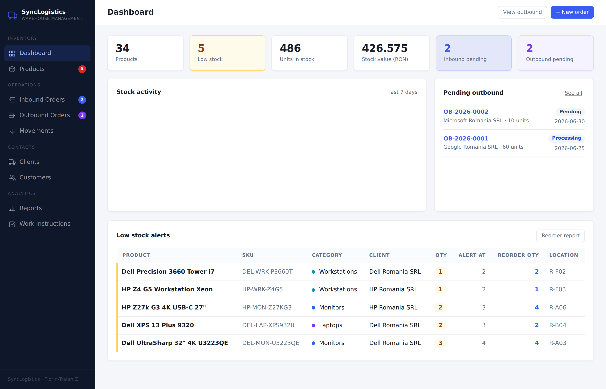

# SyncLogistics — Warehouse Management System

A full-stack warehouse management system (WMS) for an IT-hardware distributor: track stock,
manage suppliers and customers, receive inbound purchase orders, and pick & ship outbound
orders with per-item work-instruction checklists. Built as a portfolio project, modelled on a
real 3PL warehouse flow (supplier → warehouse → customer) inspired by my logistics internship
at DP World.

<!-- Live demo: replace the line below with your real link once deployed -->
**Live demo:** _coming soon (deploying to PythonAnywhere)_



## Features

- **Dashboard** — key metrics at a glance: total products, low-stock count, units in stock, total stock value, and pending inbound/outbound orders, plus a stock-activity chart and a low-stock alert table.
- **Products** — full catalogue with categories, suppliers, cost price, computed stock value, storage location, low-stock thresholds, search and filtering, quick stock adjustments, and CSV export.
- **Inbound (purchase) orders** — create orders to suppliers and receive them; receiving automatically increases stock. Orders move through `ordered → partial → received`.
- **Outbound orders** — pick and ship customer orders; shipping automatically decreases stock. Each line item carries a checklist of **work instructions** that must be completed before dispatch. Orders move through `pending → processing → shipped`.
- **Stock movements ledger** — every stock change (purchase, sale, adjustment, return) is recorded with a reason, giving full traceability of how each product reached its current quantity.
- **Suppliers & customers** — contact records linked to the orders they belong to.
- **Reports** — reorder report and stock-value report.

## Tech stack

- **Backend:** Python + [Flask](https://flask.palletsprojects.com/) — a JSON REST API plus server-rendered page shells.
- **Database:** SQLite (relational schema with foreign keys across 11 tables), accessed with parameterised queries.
- **Frontend:** server-rendered HTML via Jinja2 templates (with template inheritance), styled with plain CSS, and made interactive with vanilla JavaScript — no frontend framework.

## Architecture

The frontend and backend are decoupled. Flask serves a lightweight HTML shell for each page;
once the page loads, vanilla JavaScript calls the JSON API (`/api/...`) with `fetch()` and
renders the data into the DOM. Write operations (create / receive / ship / adjust) go back to
the API, which validates the input, updates the SQLite database, and records a stock movement
where relevant. This keeps the structure close to how production web apps separate the data
layer (API + database) from the presentation layer (browser).

## Running locally

Requires Python 3.10+.

```bash
# 1. (recommended) create and activate a virtual environment
python -m venv .venv
source .venv/bin/activate        # Windows: .venv\Scripts\activate

# 2. install dependencies
pip install -r requirements.txt

# 3. create the database tables
python -c "import app; app.init_db()"

# 4. load realistic sample data (Dell, HP, Lenovo, Logitech, Kingston)
python seed.py --reset

# 5. run
python app.py
```

Then open **http://127.0.0.1:5000**.

## Project structure

```
.
├── app.py                # Flask app: routes, JSON API, database access
├── seed.py               # populates the database with sample warehouse data
├── requirements.txt      # Python dependencies
├── templates/            # Jinja2 HTML templates (base layout + one per page)
└── static/               # CSS and JavaScript
```

## Roadmap / possible improvements

- **Authentication** — the app currently has no login; adding user accounts would be the next step toward a real multi-user product.
- Editing inline instead of delete-and-recreate.
- Move from SQLite to PostgreSQL for heavier, concurrent multi-user use.
- Automated tests.

## Author

**Florin-Traian Zadorojneac** — Automation & Applied Informatics student, Galați, Romania.
